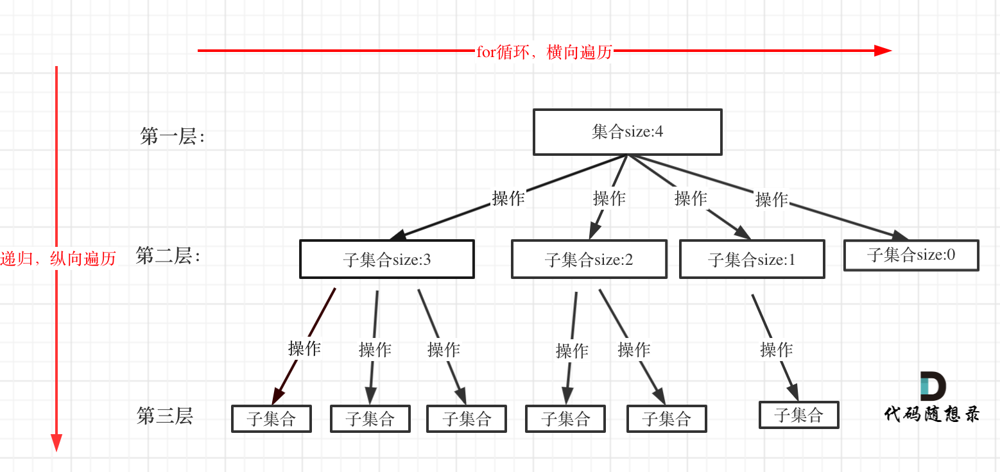

# leetcode

---

### 一、数组

常见解题方法：
- 暴力破解法
- 二分法
- 滑动窗口法
- 模拟法
- 前缀和法
- 双指针法：「双指针」，对于递增的数组，当我们需要枚举数组中的两个元素时，如果我们发现随着第一个元素的递增，第二个元素是递减的，那么就可以使用双指针的方法
- 排序+双指针法

题目汇总：

| 序号 | 题目                                                   | 难度 | 类型              | 完成时间                |
|----|------------------------------------------------------|----|-----------------|---------------------|
| 1  | [704.二分查找](docs/basic/array/704.二分查找.md)             | 简单 | 二分法             | &#10004; 2024-10-01 |
| 2  | [27.移除元素](docs/basic/array/27.移除元素.md)               | 简单 | 双指针法            | &#10004; 2024/10/01 | 
| 3  | [977.有序数组的平方](docs/basic/array/977.有序数组的平方.md)       | 简单 | 双指针法            | &#10004; 2024/10/01 |
| 4  | [209.长度最小的子数组](docs/basic/array/209.长度最小的子数组.md)     | 中等 | 暴力破解法，滑动窗口法，前缀和 | &#10004; 2024/10/01 |
| 5  | [59.螺旋矩阵II](docs/basic/array/59.螺旋矩阵II.md)           | 中等 | 模拟法             | &#10004; 2024/10/01 |
| 6  | [15.三数之和](docs/basic/array/15.三数之和.md)               | 中等 | 双指针             | &#10004; 2024/10/04 |
| 7  | [18.四数之和](docs/basic/array/18.四数之和.md)               | 中等 | 双指针             | &#10004; 2024/10/05 |
| 8  | [75.颜色分类](docs/basic/array/75.颜色分类.md)               | 中等 | 双指针             | &#10004; 2024/10/05 |
| 9  | [560.和为K的子数组](docs/basic/array/560.和为K的子数组.md)       | 中等 | 枚举              | &#10004; 2024/10/05 |
| 10 | [581.最短无序连续子数组](docs/basic/array/581.最短无序连续子数组.md)   | 中等 | 排序              | &#10004; 2024/10/05 |
| 11 | [4.寻找两个正序数组的中位数](docs/basic/array/4.寻找两个正序数组的中位数.md) | 困难 | 归并排序            | &#10004; 2024/10/05 |


最小覆盖子串 2024/11/15
搜索二维矩阵 II 2024/11/20
数组中的第K个最大元素 2024/11/19
寻找重复数 2024/11/21
盛最多水的容器 &#10004; 2024/11/25
搜索旋转排序数组 &#10004; 2024/11/26
旋转图像 &#10004; 2024/11/26
1365.有多少小于当前数字的数字
941.有效的山脉数组 （双指针）
1207.独一无二的出现次数 数组在哈希法中的经典应用
283.移动零 【数组】【双指针】
189.旋转数组
724.寻找数组的中心索引
34.在排序数组中查找元素的第一个和最后一个位置 （二分法）
922.按奇偶排序数组II
35.搜索插入位置


---

### 二、字符串

常见解题方法：
- 双指针
- 模拟法
- 穷举法

题目汇总：

| 序号 | 题目                                                  | 难度 | 类型  | 完成时间                |
|----|-----------------------------------------------------|----|-----|---------------------|
| 1  | [344.反转字符串](docs/basic/string/344.反转字符串.md)         | 简单 | 双指针 | &#10004; 2024/10/05 |
| 2  | [541.反转字符串II](docs/basic/string/541.反转字符串II.md)     | 简单 | 模拟法 | &#10004; 2024/10/05 |
| 3  | [459.重复的子字符串](docs/basic/string/459.重复的子字符串.md)     | 简单 | 穷举法 | &#10004; 2024/10/05 |
| 4  | [151.反转字符串中的单词](docs/basic/string/151.反转字符串中的单词.md) | 中等 | 模拟法 | &#10004; 2024/10/06 |
| 5  | [844.比较含退格的字符串](docs/basic/string/844.比较含退格的字符串.md) | 简单 |     | &#10004; 2024/10/06 |

无重复字符的最长子串 &#10004; 2024/11/25
字符串解码 2024/11/23
找到字符串中所有字母异位词 2024/11/24
字母异位词分组 &#10004; 2024/11/27

---

### 三、链表

常见解题方法：
- 递归法：链表的定义具有递归的性质，因此链表题目常可以用递归的方法求解。
- 模拟迭代法：迭代整个链表，完成指定操作
- 头插法：利用头插法创建表可以解决翻转链表等问题
- 快慢指针法：双指针
- 哈希表法：创建map记录已经出现的信息

题目汇总：

| 序号 | 题目                                                         | 难度 | 类型                | 完成时间                |
|----|------------------------------------------------------------|----|-------------------|---------------------|
| 1  | [203.移除链表元素](docs/basic/link-list/203.移除链表元素.md)           | 简单 | 递归法，迭代法           | &#10004; 2024/10/02 |
| 2  | [707.设计链表](docs/basic/link-list/707.设计链表.md)               | 中等 | 模拟迭代法             | &#10004; 2024/10/02 |
| 3  | [206.反转链表](docs/basic/link-list/206.反转链表.md)               | 简单 | 头插法               | &#10004; 2024/10/02 |
| 4  | [24.两两交换链表中的节点](docs/basic/link-list/24.两两交换链表中的节点.md)     | 中等 | 模拟迭代法             | &#10004; 2024/10/02 |
| 5  | [19.删除链表的倒数第N个结点](docs/basic/link-list/19.删除链表的倒数第N个结点.md) | 中等 | 快慢指针法             | &#10004; 2024/10/02 |
| 6  | [160.相交链表](docs/basic/link-list/160.相交链表.md)               | 中等 | 快慢指针法             | &#10004; 2024/10/03 |
| 7  | [141.环形链表](docs/basic/link-list/141.环形链表.md)               | 中等 | 快慢指针法，哈希表法        | &#10004; 2024/10/03 |
| 8  | [234.回文链表](docs/basic/link-list/234.回文链表.md)               | 简单 | 双指针               | &#10004; 2024/10/03 |
| 9  | [143.重排链表](docs/basic/link-list/143.重排链表.md)               | 中等 | 快慢指针找中点+翻转链表+合并链表 | &#10004; 2024/10/03 |
| 10 | [21.合并两个有序链表](docs/basic/link-list/21.合并两个有序链表.md)         | 简单 | 合并链表              | &#10004; 2024/10/03 |
| 11 | [23.合并K个升序链表](docs/basic/link-list/23.合并K个升序链表.md)         | 困难 | 顺序、分治             | &#10004; 2024/10/03 |
| 12 | [148.排序链表](docs/basic/link-list/148.排序链表.md)               | 中等 | 归并排序              | &#10004; 2024/10/03 |
| 13 | [2.两数相加](docs/basic/link-list/2.两数相加.md)                   | 中等 | 模拟                | &#10004; 2024/10/03 |

LRU 缓存 2024/11/17

---

### 四、哈希表

哈希表是根据关键码的值而直接进行访问的数据结构，一般哈希表都是用来快速判断一个元素是否出现集合里。Go 语言中可以使用 map 实现哈希表

哈希表中的关键概念
- 哈希函数
- 冲突
- 解决冲突的方法：拉链法，线性探测法

常见解题方法：
- 哈希表法
- 分组+哈希表法：

题目汇总：

| 序号 | 题目                                                    | 难度 | 类型  | 完成时间                |
|----|-------------------------------------------------------|----|-----|---------------------|
| 1  | [242.有效的字母异位词](docs/basic/hash-table/242.有效的字母异位词.md) | 简单 | 哈希表 | &#10004; 2024/10/03 |
| 2  | [205.同构字符串](docs/basic/hash-table/205.同构字符串.md)       | 简单 | 哈希表 | &#10004; 2024/10/03 |
| 3  | [383.赎金信](docs/basic/hash-table/383.赎金信.md)           | 简单 | 哈希表 | &#10004; 2024/10/03 |
| 4  | [1002.查找常用字符](docs/basic/hash-table/1002.查找常用字符.md)   | 简单 | 哈希表 | &#10004; 2024/10/03 |
| 5  | [349.两个数组的交集](docs/basic/hash-table/349.两个数组的交集.md)   | 简单 | 哈希表 | &#10004; 2024/10/04 |
| 6  | [202.快乐数](docs/basic/hash-table/202.快乐数.md)           | 简单 | 哈希表 | &#10004; 2024/10/04 |
| 7  | [1.两数之和](docs/basic/hash-table/1.两数之和.md)             | 简单 | 哈希表 | &#10004; 2024/10/04 |
| 8  | [454.四数相加II](docs/basic/hash-table/454.四数相加II.md)     | 中等 | 哈希表 | &#10004; 2024/10/04 |

多数元素 &#10004; 2024/11/28
找到所有数组中消失的数字 &#10004; 2024/11/29
最长连续序列 2024/11/17

---

### 五、栈与队列

使用切片来模拟栈：stack := []int{}
- 栈空判断      len(stack) == 0
- Push 操作    stack = append(stack, e)
- Pop 操作     如果栈不空 stack = stack[0:len(stack)-1]
- Top 操作     如果栈不空 e := stack[len(stack)-1]

使用切片来模拟队列：queue := []int{}
- 队列空判断     len(queue) == 0
- Push 操作     queue = append(queue, e)
- Pop 操作      如果栈不空 queue = queue[1:len(queue)]
- Peek 操作     如果栈不同 e := queue[0]


单调栈是一种特殊的栈数据结构，其中栈内的元素保持单调递增或单调递减的顺序。‌这意味着栈中的元素从栈底到栈顶是严格递增或递减的。

单调栈的工作原理：基于栈的先进后出特性。当新元素加入栈时，如果新元素比栈顶元素大，则将栈顶元素弹出，直到栈为空或栈顶元素小于新元素为止。这样，栈内始终保持单调性。

单调栈的应用场景：单调栈常用于解决一些特定的问题，如寻找数组中每个元素右边第一个比它大的元素、每个元素左边第一个比它小的元素等。通过维护栈的单调性，可以高效地解决这些问题。

常见解题方法：
- 栈：括号匹配，双栈模拟队列，逆波兰式求值，单调栈+哈希表，单调栈，
- 队列：双队列模拟栈
- 堆：求最大值，前K最大值


题目汇总：

| 序号 | 题目                                                                   | 难度 | 类型             | 完成时间                |
|----|----------------------------------------------------------------------|----|----------------|---------------------|
| 1  | [20.有效的括号](docs/basic/stack-queue/20.有效的括号.md)                       | 简单 | 栈              | &#10004; 2024/10/06 |
| 2  | [232.用栈实现队列](docs/basic/stack-queue/232.用栈实现队列.md)                   | 简单 | 双栈模拟队列         | &#10004; 2024/10/06 |
| 3  | [225.用队列实现栈](docs/basic/stack-queue/225.用队列实现栈.md)                   | 简单 | 双队列模拟栈         | &#10004; 2024/10/06 |
| 4  | [1047.删除字符串中的所有相邻重复项](docs/basic/stack-queue/1047.删除字符串中的所有相邻重复项.md) | 简单 | 栈              | &#10004; 2024/10/06 |
| 5  | [150.逆波兰表达式求值](docs/basic/stack-queue/150.逆波兰表达式求值.md)               | 中等 | 栈              | &#10004; 2024/10/07 |
| 6  | [347.前K个高频元素](docs/basic/stack-queue/347.前K个高频元素.md)                 | 中等 | 哈希表+排序，哈希表+小顶堆 | &#10004; 2024/10/07 |
| 7  | [239.滑动窗口最大值](docs/basic/stack-queue/239.滑动窗口最大值.md)                 | 困难 | 大顶堆（优先队列）      | &#10004; 2024/10/07 |
| 8  | [739.每日温度](docs/basic/stack-queue/739.每日温度.md)                       | 中等 | 单调栈            | &#10004; 2024/10/07 |
| 9  | [496.下一个更大元素I](docs/basic/stack-queue/496.下一个更大元素I.md)               | 简单 | 单调栈+哈希表        | &#10004; 2024/10/07 |
| 10 | [503.下一个更大元素II](docs/basic/stack-queue/503.下一个更大元素II.md)             | 中等 | 单调栈            | &#10004; 2024/10/08 |
| 11 | [42.接雨水](docs/basic/stack-queue/42.接雨水.md)                           | 困难 | 单调栈            | &#10004; 2024/10/08 |
| 12 | [84.柱状图中最大的矩形](docs/basic/stack-queue/84.柱状图中最大的矩形.md)               | 困难 | 单调栈            | &#10004; 2024/10/08 | 

最小栈 &#10004; 2024/11/28
最大矩形 2024/11/16
会议室 II 2024/11/21

---

### 六、二叉树

二叉树的定义：

```go
type TreeNode struct {
    Val int
    Left *TreeNode
    Right *TreeNode
}
```

常见解题方法：

- 递归遍历：先序遍历，中序遍历，后序遍历
- 迭代遍历：先序遍历（辅助栈），中序遍历（辅助栈），后序遍历（辅助栈）
- 层序遍历（辅助队列）

题目汇总：

| 序号 | 题目                                                                         | 难度 | 类型         | 完成时间                |
|----|----------------------------------------------------------------------------|----|------------|---------------------|
| 1  | [144.二叉树的前序遍历](docs/basic/binary-tree/144.二叉树的前序遍历.md)                     | 简单 | 递归遍历，迭代遍历  | &#10004; 2024/10/09 |
| 2  | [145.二叉树的后序遍历](docs/basic/binary-tree/145.二叉树的后序遍历.md)                     | 简单 | 递归遍历，迭代遍历  | &#10004; 2024/10/09 |
| 3  | [94.二叉树的中序遍历](docs/basic/binary-tree/94.二叉树的中序遍历.md)                       | 简单 | 递归遍历，迭代遍历  | &#10004; 2024/10/09 |
| 4  | [102.二叉树的层序遍历](docs/basic/binary-tree/102.二叉树的层序遍历.md)                     | 中等 | 层序遍历       | &#10004; 2024/10/10 |
| 5  | [107.二叉树的层次遍历II](docs/basic/binary-tree/107.二叉树的层次遍历II.md)                 | 中等 | 层序遍历       | &#10004; 2024/10/10 |
| 6  | [199.二叉树的右视图](docs/basic/binary-tree/199.二叉树的右视图.md)                       | 中等 | 层序遍历       | &#10004; 2024/10/10 |
| 7  | [637.二叉树的层平均值](docs/basic/binary-tree/637.二叉树的层平均值.md)                     | 简单 | 层序遍历       | &#10004; 2024/10/11 |
| 8  | [429.N叉树的层序遍历](docs/basic/binary-tree/429.N叉树的层序遍历.md)                     | 中等 | 层序遍历       | &#10004; 2024/10/11 |
| 9  | [515.在每个树行中找最大值](docs/basic/binary-tree/515.在每个树行中找最大值.md)                 | 中等 | 层序遍历       | &#10004; 2024/10/11 |
| 10 | [116.填充每个节点的下一个右侧节点指针](docs/basic/binary-tree/116.填充每个节点的下一个右侧节点指针.md)     | 中等 | 层序遍历       | &#10004; 2024/10/12 |
| 11 | [117.填充每个节点的下一个右侧节点指针II](docs/basic/binary-tree/117.填充每个节点的下一个右侧节点指针II.md) | 中等 | 层序遍历       | &#10004; 2024/10/12 |
| 12 | [104.二叉树的最大深度](docs/basic/binary-tree/104.二叉树的最大深度.md)                     | 简单 | 递归(后序遍历改造) | &#10004; 2024/10/12 |
| 13 | [111.二叉树的最小深度](docs/basic/binary-tree/111.二叉树的最小深度.md)                     | 简单 | 递归(后序遍历改造) | &#10004; 2024/10/13 |
| 14 | [226.翻转二叉树](docs/basic/binary-tree/226.翻转二叉树.md)                           | 简单 | 递归(先序遍历改造) | &#10004; 2024/10/13 |
| 15 | [101.对称二叉树](docs/basic/binary-tree/101.对称二叉树.md)                           | 简单 | 递归         | &#10004; 2024/10/14 |
| 16 | [100.相同的树](docs/basic/binary-tree/100.相同的树.md)                             | 简单 | 递归         | &#10004; 2024/10/14 |
| 17 | [222.完全二叉树的节点个数](docs/basic/binary-tree/222.完全二叉树的节点个数.md)                 | 简单 | 递归（后序遍历改造） | &#10004; 2024/10/14 |
| 18 | [110.平衡二叉树](docs/basic/binary-tree/110.平衡二叉树.md)                           | 简单 | 递归（后序遍历改造） | &#10004; 2024/10/14 |
| 19 | [257.二叉树的所有路径](docs/basic/binary-tree/257.二叉树的所有路径.md)                     | 简单 | 简单         | 深（广）度优先遍历           | &#10004; 2024/10/15 |
| 20 | [404.左叶子之和](docs/basic/binary-tree/404.左叶子之和.md)                           | 简单 | 深（广）度优先遍历  | &#10004; 2024/10/15 |
| 21 | [513.找树左下角的值](docs/basic/binary-tree/513.找树左下角的值.md)                       | 中等 | 层次遍历       | &#10004; 2024/10/15 |
| 22 | [112.路径总和](docs/basic/binary-tree/112.路径总和.md)                             | 简单 | 深（广）度优先遍历  | &#10004; 2024/10/16 |
| 23 | [106.从中序与后序遍历序列构造二叉树](docs/basic/binary-tree/106.从中序与后序遍历序列构造二叉树.md)       | 中等 | 简单         | 递归                  | &#10004; 2024/10/16 |
| 24 | [105.从前序与中序遍历序列构造二叉树](docs/basic/binary-tree/105.从前序与中序遍历序列构造二叉树.md)       | 中等 | 简单         | 递归                  | &#10004; 2024/10/16 |
| 25 | [654.最大二叉树](docs/basic/binary-tree/654.最大二叉树.md)                           | 中等 | 递归（先序遍历改造） | &#10004; 2024/10/16 |
| 26 | [617.合并二叉树](docs/basic/binary-tree/617.合并二叉树.md)                           | 简单 | 递归         | &#10004; 2024/10/17 |
| 27 | [700.二叉搜索树中的搜索](docs/basic/binary-tree/700.二叉搜索树中的搜索.md)                   | 简单 | 递归，迭代      | &#10004; 2024/10/17 |
| 28 | [98.验证二叉搜索树](docs/basic/binary-tree/98.验证二叉搜索树.md)                         | 中等 | 简单         | 递归                  | &#10004; 2024/10/17 |
| 29 | [530.二叉搜索树的最小绝对差](docs/basic/binary-tree/530.二叉搜索树的最小绝对差.md)               | 简单 | 简单         | 递归（中序遍历改造）          | &#10004; 2024/10/18 |
| 30 | [501.二叉搜索树中的众数](docs/basic/binary-tree/501.二叉搜索树中的众数.md)                   | 简单 | 简单         | 递归（中序遍历改造）          | &#10004; 2024/10/18 |
| 31 | [236.二叉树的最近公共祖先](docs/basic/binary-tree/236.二叉树的最近公共祖先.md)                 | 中等 | 简单         | 递归                  | &#10004; 2024/10/18 |
| 32 | [235.二叉搜索树的最近公共祖先](docs/basic/binary-tree/235.二叉搜索树的最近公共祖先.md)             | 中等 | 简单         | 迭代                  | &#10004; 2024/10/19 |
| 33 | [701.二叉搜索树中的插入操作](docs/basic/binary-tree/701.二叉搜索树中的插入操作.md)               | 中等 | 简单         | 模拟                  | &#10004; 2024/10/19 |
| 34 | [450.删除二叉搜索树中的节点](docs/basic/binary-tree/450.删除二叉搜索树中的节点.md)               | 中等 | 简单         | 递归                  | &#10004; 2024/10/19 |
| 35 | [669.修剪二叉搜索树](docs/basic/binary-tree/669.修剪二叉搜索树.md)                       | 中等 | 简单         | 递归                  | &#10004; 2024/10/20 |
| 36 | [108.将有序数组转换为二叉搜索树](docs/basic/binary-tree/108.将有序数组转换为二叉搜索树.md)           | 简单 | 递归         | &#10004; 2024/10/20 |
| 37 | [538.把二叉搜索树转换为累加树](docs/basic/binary-tree/538.把二叉搜索树转换为累加树.md)             | 中等 | 递归（反中序遍历）  | &#10004; 2024/10/20 |
| 38 | [129.求根节点到叶节点数字之和](docs/basic/binary-tree/129.求根节点到叶节点数字之和.md)             | 中等 | 递归（深度优先遍历） | &#10004; 2024/10/20 |
| 39 | [114.二叉树展开为链表](docs/basic/binary-tree/114.二叉树展开为链表.md)                     | 中等 | 先序遍历       | &#10004; 2024/10/03 |

二叉树的直径 &#10004; 2024/11/29
二叉树的序列化与反序列化 2024/11/21
二叉树中的最大路径和 2024/11/16
路径总和III 2024/11/23

---

### 七、贪心算法

常见解题方法：
- 简单贪心
- 排序+贪心
- 哈希表+贪心

题目汇总：

| 序号 | 题目                                                         | 难度 | 类型           | 完成时间                |
|----|------------------------------------------------------------|----|--------------|---------------------|
| 1  | [455.分发饼干](docs/algr/greedy/455.分发饼干.md)                   | 简单 | 简单贪心         | &#10004; 2024/10/21 |
| 2  | [1005.K次取反后最大化的数组和](docs/algr/greedy/1005.K次取反后最大化的数组和.md) | 简单 | 简单贪心         | &#10004; 2024/10/21 |
| 3  | [860.柠檬水找零](docs/algr/greedy/860.柠檬水找零.md)                 | 简单 | 简单贪心         | &#10004; 2024/10/21 |
| 4  | [1221.分割平衡字符](docs/algr/greedy/1221.分割平衡字符.md)             | 简单 | 简单贪心         | &#10004; 2024/10/22 |
| 5  | [376.摆动序列](docs/algr/greedy/376.摆动序列.md)                   | 中等 | 简单贪心         | &#10004; 2024/10/22 |
| 6  | [738.单调递增的数字](docs/algr/greedy/738.单调递增的数字.md)             | 中等 | 贪心-序列问题      | &#10004; 2024/10/22 |
| 7  | [121.买卖股票的最佳时机](docs/algr/greedy/121.买卖股票的最佳时机.md)         | 简单 | 贪心-股票问题      | &#10004; 2024/11/18 |
| 8  | [122.买卖股票的最佳时机II](docs/algr/greedy/122.买卖股票的最佳时机II.md)     | 中等 | 贪心-股票问题      | &#10004; 2024/10/23 |
| 9  | [714.买卖股票的最佳时机含手续费](docs/algr/greedy/714.买卖股票的最佳时机含手续费.md) | 中等 | 贪心-股票问题      | &#10004; 2024/10/23 |
| 10 | [135.分发糖果](docs/algr/greedy/135.分发糖果.md)                   | 困难 | 贪心-两个维度权衡问题  | &#10004; 2024/10/23 |
| 11 | [406.根据身高重建队列](docs/algr/greedy/406.根据身高重建队列.md)           | 中等 | 贪心-两个维度权衡问题  | &#10004; 2024/10/24 |
| 12 | [55.跳跃游戏](docs/algr/greedy/55.跳跃游戏.md)                     | 中等 | 贪心-区间问题      | &#10004; 2024/10/24 |
| 13 | [45.跳跃游戏II](docs/algr/greedy/45.跳跃游戏II.md)                 | 中等 | 贪心-区间问题      | &#10004; 2024/10/24 |
| 14 | [452.用最少数量的箭引爆气球](docs/algr/greedy/452.用最少数量的箭引爆气球.md)     | 中等 | 贪心-区间问题（排序）  | &#10004; 2024/10/25 |
| 15 | [435.无重叠区间](docs/algr/greedy/435.无重叠区间.md)                 | 中等 | 贪心-区间问题（排序）  | &#10004; 2024/10/25 |
| 16 | [763.划分字母区间](docs/algr/greedy/763.划分字母区间.md)               | 中等 | 贪心-区间问题（哈希表） | &#10004; 2024/10/25 |
| 17 | [56.合并区间](docs/algr/greedy/56.合并区间.md)                     | 中等 | 贪心-区间问题（排序）  | &#10004; 2024/10/26 |
| 18 | [53.最大子数组和](docs/algr/greedy/53.最大子数组和.md)                 | 中等 | 贪心-序列问题      | &#10004; 2024/10/26 |
| 19 | [134.加油站](docs/algr/greedy/134.加油站.md)                     | 中等 | 贪心           | &#10004; 2024/10/26 |


---

### 八、回溯算法

回溯法也可以叫做回溯搜索法，它是一种搜索的方式。回溯的本质是穷举，穷举所有可能，然后选出我们想要的答案。 递归与回溯相辅相成。回溯就是一个递归的过程

所有回溯法的问题都可以抽象为树形结构，因为回溯法解决的都是在集合中递归查找子集，集合的大小就构成了树的宽度，递归的深度就构成了树的深度。
递归就要有终止条件，所以必然是一棵高度有限的树（N叉树）。


回溯法，一般可以解决如下几种问题：

- 组合问题：N个数里面按一定规则找出k个数的集合
- 切割问题：一个字符串按一定规则有几种切割方式
- 子集问题：一个N个数的集合里有多少符合条件的子集
- 排列问题：N个数按一定规则全排列，有几种排列方式
- 棋盘问题：N皇后，解数独等等


回溯算法模板：

回溯函数模板返回值以及参数：
- 返回值一般为void
- 一般是先写逻辑，然后需要什么参数，就填什么参数

回溯函数终止条件：
- 什么时候达到了终止条件，树中就可以看出，一般来说搜到叶子节点了，也就找到了满足条件的一条答案，把这个答案存放起来，并结束本层递归。

回溯搜索的遍历过程：回溯法一般是在集合中递归搜索，集合的大小构成了树的宽度，递归的深度构成的树的深度
- for 循环，横向遍历
- 递归，纵向遍历



回溯算法模板框架：

```
void backtracking(参数) {
    if (终止条件) {
        存放结果;
        return;
    }
    // 横向搜索
    for (选择：本层集合中元素（树中节点孩子的数量就是集合的大小）) { // for循环就是遍历集合区间，可以理解一个节点有多少个孩子，这个for循环就执行多少次
        处理节点;
        backtracking(路径，选择列表); // 递归,纵向搜索
        回溯，撤销处理结果
    } // 这样就把这棵树全遍历完了，一般来说，搜索叶子节点就是找的其中一个结果了
}
```

常用解题方法：
- 回溯
- 回溯 + 去重（排序+横向去重）

题目汇总：

| 序号 | 题目                                                      | 难度 |         | 类型                  | 完成时间 |
|----|---------------------------------------------------------|----|---------|---------------------|------|
| 1  | [77.组合](docs/algr/back-tracking/77.组合.md)               | 中等 | 回溯-组合问题 | &#10004; 2024/10/27 |
| 2  | [17.电话号码的字母组合](docs/algr/back-tracking/17.电话号码的字母组合.md) | 中等 | 回溯-组合问题 | &#10004; 2024/10/27 |
| 3  | [39.组合总和](docs/algr/back-tracking/39.组合总和.md)           | 中等 | 回溯-组合问题 | &#10004; 2024/10/27 |
| 4  | [40.组合总和II](docs/algr/back-tracking/40.组合总和II.md)       | 中等 | 回溯-组合问题 | &#10004; 2024/10/28 |
| 5  | [216.组合总和III](docs/algr/back-tracking/216.组合总和III.md)   | 中等 | 回溯-组合问题 | &#10004; 2024/10/28 |
| 6  | [131.分割回文串](docs/algr/back-tracking/131.分割回文串.md)       | 中等 | 回溯-分割问题 | &#10004; 2024/10/28 |
| 7  | [93.复原IP地址](docs/algr/back-tracking/93.复原IP地址.md)       | 中等 | 回溯-分割问题 | &#10004; 2024/10/29 |
| 8  | [78.子集](docs/algr/back-tracking/78.子集.md)               | 中等 | 回溯-子集问题 | &#10004; 2024/10/29 |
| 9  | [90.子集II](docs/algr/back-tracking/90.子集II.md)           | 中等 | 回溯-子集问题 | &#10004; 2024/10/29 |
| 10 | [46.全排列](docs/algr/back-tracking/46.全排列.md)             | 中等 | 回溯-排列问题 | &#10004; 2024/10/30 |
| 11 | [47.全排列II](docs/algr/back-tracking/47.全排列II.md)         | 中等 | 回溯-排列问题 | &#10004; 2024/10/30 |
| 12 | [51.N皇后](docs/algr/back-tracking/51.N皇后.md)             | 困难 | 回溯-棋盘问题 | &#10004; 2024/10/30 |
| 13 | [52.N皇后II](docs/algr/back-tracking/52.N皇后II.md)         | 困难 | 回溯-棋盘问题 | &#10004; 2024/10/31 |
| 14 | [491.非递减子序列](docs/algr/back-tracking/491.非递减子序列.md)     | 中等 | 回溯-序列问题 | &#10004; 2024/10/31 |
| 15 | [22.括号生成](docs/algr/back-tracking/22.括号生成.md)           | 中等 | 回溯      | &#10004; 2024/10/31 |


单词搜索 2024/11/15


---


### 九、动态规划

常见题目类型：

- 基础题目
- 背包问题
- 打家劫舍
- 股票问题
- 子序列问题

第一步：dp 数组以及下标的含义，以及 dp数组如何初始化

第二步：递推公式

第三步：dp 数组的遍历顺序

第四步：打印 dp 数组


**0-1背包问题**

有 n 种物品，每种物品只有一个；每个物品有自己的重量和价值；有最多存放 m 重量的背包，问这个背包最多能装价值为多少的物品

暴力解法：每个物品有取与不取两种状态，可以使用回溯暴力求解

dp 解法：

dp 数组定义：dp[i][j] 表示 在背包容量为 j 的情况下，在0~i物品之间选择任意物品的最大价值

对于第 i 个物品，有两种状态
不放      背包中的价值：dp[i-1][j]
放        背包中的价值：dp[i-1][j-w[i]] + v[i]
则 状态转移方程 dp[i][j] = max(dp[i-1][j], dp[i-1][j-w[i]] + v[i]) j>=w[i]
                       = dp[i-1][j]                              j<w[i]

dp 数组初始化: dp[i][j] 依赖 dp[i-1][j]，dp[i-1][j-w[i]]， 依赖正上放，和左上放，因此应该初始化第 0 行和 第 0列

第 0 行初始化方式：背包容量小于物品0的价值为0，大于等于则为物品0的价值
第 0 列初始化为 0
其他初始化为 0 即可

dp[i][j]    背包容量
 i           0   1   2   3   4               j
物品 0      
物品 1      
物品 2      


遍历顺序：两层for循环，一个遍历物品，一个遍历背包

对于 2 维 dp 数组，两层 for 循环的遍历顺序可以颠倒，原因是 递推公式，，按行遍历，按列遍历均可以进行
```go
for i:=1; i<n; i++ {
    for j:=1;j<=target;j++ {
        if j<stones[i] {
            dp[i][j] = dp[i-1][j]
        } else {
            dp[i][j] = max(dp[i-1][j], dp[i-1][j-stones[i]] + stones[i])
        }
    }
}
```

完全背包
有 n 种物品，每种物品有无限个

完全背包和 0-1 背包二维dp数组的代码只有一个下标不同
// 0-1 背包
dp[i][j] = max(dp[i-1][j], dp[i-1][j-weight[i] + value[i]);
// 完全背包 第 i 个物品可以多次取
dp[i][j] = max(dp[i-1][j], dp[i][j-weight[i]] + value[i]);


题目汇总：

| 序号 | 题目                                                                      | 难度 | 类型       | 完成时间                |
|----|-------------------------------------------------------------------------|----|----------|---------------------|
| 1  | [509.斐波那契数](docs/algr/dynamic-programming/509.斐波那契数.md)                 | 简单 | 基础题目     | &#10004; 2024/11/11 |
| 2  | [70.爬楼梯](docs/algr/dynamic-programming/70.爬楼梯.md)                       | 简单 | 基础题目     | &#10004; 2024/11/11 |
| 3  | [746.使用最小花费爬楼梯](docs/algr/dynamic-programming/746.使用最小花费爬楼梯.md)         | 简单 | 基础题目     | &#10004; 2024/11/11 |
| 4  | [62.不同路径](docs/algr/dynamic-programming/62.不同路径.md)                     | 中等 | 基础题目     | &#10004; 2024/11/12 |
| 5  | [63.不同路径II](docs/algr/dynamic-programming/63.不同路径II.md)                 | 中等 | 基础题目     | &#10004; 2024/11/12 |
| 6  | [343.整数拆分](docs/algr/dynamic-programming/343.整数拆分.md)                   | 中等 | 基础题目     | &#10004; 2024/11/12 |
| 7  | [96.不同的二叉搜索树](docs/algr/dynamic-programming/96.不同的二叉搜索树.md)             | 中等 | 基础题目     | &#10004; 2024/11/12 |
| 8  | [64.最小路径和](docs/algr/dynamic-programming/64.最小路径和.md)                   | 中等 | 基础题目     | &#10004; 2024/11/13 |
| 9  | [152.乘积最大子数组](docs/algr/dynamic-programming/152.乘积最大子数组.md)             | 中等 | 基础题目     | &#10004; 2024/11/13 |
| 10 | [221.最大正方形](docs/algr/dynamic-programming/221.最大正方形.md)                 | 中等 | 基础题目     | &#10004; 2024/11/13 |
| 11 | [416.分割等和子集](docs/algr/dynamic-programming/416.分割等和子集.md)               | 中等 | 01背包问题   | &#10004; 2024/11/13 |
| 12 | [494.目标和](docs/algr/dynamic-programming/494.目标和.md)                     | 中等 | 01背包问题   | &#10004; 2024/11/14 |
| 13 | [1049.最后一块石头的重量II](docs/algr/dynamic-programming/1049.最后一块石头的重量II.md)   | 中等 | 01背包问题   | &#10004; 2024/11/14 |
| 14 | [474.一和零](docs/algr/dynamic-programming/474.一和零.md)                     | 中等 | 01背包问题   | &#10004; 2024/11/14 |
| 15 | [518.零钱兑换II](docs/algr/dynamic-programming/518.零钱兑换II.md)               | 中等 | 完全背包问题   | &#10004; 2024/11/15 |
| 16 | [377.组合总和Ⅳ](docs/algr/dynamic-programming/377.组合总和Ⅳ.md)                 | 中等 | 完全背包问题   | &#10004; 2024/11/15 |
| 17 | [322.零钱兑换](docs/algr/dynamic-programming/322.零钱兑换.md)                   | 中等 | 完全背包问题   | &#10004; 2024/11/16 |
| 18 | [279.完全平方数](docs/algr/dynamic-programming/279.完全平方数.md)                 | 中等 | 动态规划     | &#10004; 2024/11/16 |
| 19 | [139.单词拆分](docs/algr/dynamic-programming/139.单词拆分.md)                   | 中等 | 动态规划+哈希表 | &#10004; 2024/11/16 |
| 20 | [198.打家劫舍](docs/algr/dynamic-programming/198.打家劫舍.md)                   |    | 打家劫舍问题   | &#10004; 2024/11/17 |
| 21 | [213.打家劫舍II](docs/algr/dynamic-programming/213.打家劫舍II.md)               |    | 打家劫舍问题   | &#10004; 2024/11/17 |
| 22 | [337.打家劫舍III](docs/algr/dynamic-programming/337.打家劫舍III.md)             |    | 打家劫舍问题   | &#10004; 2024/11/17 |
| 25 | [123.买卖股票的最佳时机III](docs/algr/dynamic-programming/123.买卖股票的最佳时机III.md)   |    | 股票问题     | 2024/11/18          |
| 26 | [188.买卖股票的最佳时机IV](docs/algr/dynamic-programming/188.买卖股票的最佳时机IV.md)     |    | 股票问题     | 2024/11/19          |
| 27 | [309.最佳买卖股票时机含冷冻期](docs/algr/dynamic-programming/309.最佳买卖股票时机含冷冻期.md)   |    | 股票问题     | 2024/11/19          |
| 29 | [300.最长递增子序列](docs/algr/dynamic-programming/300.最长递增子序列.md)             |    | 子序列问题    | 2024/11/20          |
| 30 | [673.最长递增子序列的个数](docs/algr/dynamic-programming/673.最长递增子序列的个数.md)       |    | 子序列问题    | 2024/11/20          |
| 31 | [1143.最长公共子序列](docs/algr/dynamic-programming/1143.最长公共子序列.md)           |    | 子序列问题    | 2024/11/20          |
| 32 | [1035.不相交的线](docs/algr/dynamic-programming/1035.不相交的线.md)               |    | 子序列问题    | 2024/11/21          |
| 33 | [674.最长连续递增序列](docs/algr/dynamic-programming/674.最长连续递增序列.md)           |    | 子序列问题    | 2024/11/21          |
| 34 | [718.最长重复子数组](docs/algr/dynamic-programming/718.最长重复子数组.md)             |    | 子序列问题    | 2024/11/21          |
| 35 | [53.最大子序和](docs/algr/dynamic-programming/53.最大子序和.md)                   |    | 子序列问题    | 2024/11/22          |
| 36 | [392.判断子序列](docs/algr/dynamic-programming/392.判断子序列.md)                 |    | 子序列问题    | 2024/11/22          |
| 37 | [115.不同的子序列](docs/algr/dynamic-programming/115.不同的子序列.md)               |    | 子序列问题    | 2024/11/22          |
| 38 | [583.两个字符串的删除操作](docs/algr/dynamic-programming/583.两个字符串的删除操作.md)       |    | 子序列问题    | 2024/11/23          |
| 39 | [72.编辑距离](docs/algr/dynamic-programming/72.编辑距离.md)                     |    | 子序列问题    | 2024/11/23          |
| 40 | [647.回文子串](docs/algr/dynamic-programming/647.回文子串.md)                   |    | 回文问题     | 2024/11/23          |
| 41 | [5.最长回文子串](docs/algr/dynamic-programming/5.最长回文子串.md)                   |    | 回文问题     | 2024/11/24          |
| 42 | [132.分割回文串II](docs/algr/dynamic-programming/132.分割回文串II.md)             |    | 回文问题     | 2024/11/24          |
| 43 | [516.最长回文子序列](docs/algr/dynamic-programming/516.最长回文子序列.md)             |    | 回文问题     | 2024/11/24          |
| 44 | [10.正则表达式匹配](docs/algr/dynamic-programming/10.正则表达式匹配.md)               |    |          | 2024/11/24          |
| 45 | [32.最长有效括号](docs/algr/dynamic-programming/32.最长有效括号.md)                 |    |          | 2024/11/24          |


### 十、其他

题目汇总：

| 序号 | 题目                                               | 难度 |       | 类型                  | 完成时间 |
|----|--------------------------------------------------|----|-------|---------------------|------|
| 1  | [136.只出现一次的数字](docs/basic/other/136.只出现一次的数字.md) | 简单 | 位运算   | &#10004; 2024/10/27 |
| 2  | [461.汉明距离](docs/basic/other/461.汉明距离.md)         | 简单 | 位运算   | &#10004; 2024/10/27 |
| 3  | [338.比特位计数](docs/basic/other/338.比特位计数.md)       | 简单 | 位运算   | &#10004; 2024/10/27 |
| 4  | [684.冗余连接](docs/basic/other/684.冗余连接.md)         | 中等 | 并查集   | 2024/10/27          |
| 5  | [685.冗余连接II](docs/basic/other/685.冗余连接II.md)     | 困难 | 并查集   | 2024/10/27          |
| 6  | [31.下一个排列](docs/basic/other/31.下一个排列.md)         | 中等 | 下一个排列 | 2024/10/27          |

岛屿数量 2024/11/18
课程表 2024/11/18
实现 Trie (前缀树) 2024/11/19
除自身以外数组的乘积 2024/11/20
删除无效的括号 2024/11/22
戳气球 2024/11/22
除法求值 2024/11/23
任务调度器 2024/11/24

---

做前 25 题
图：判断图中是否存在环

