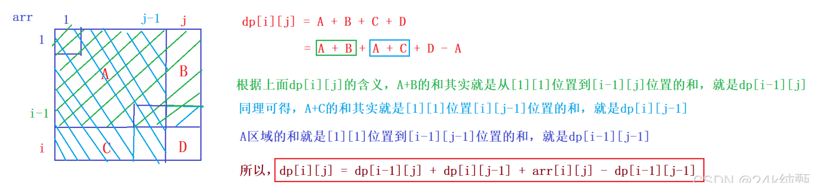
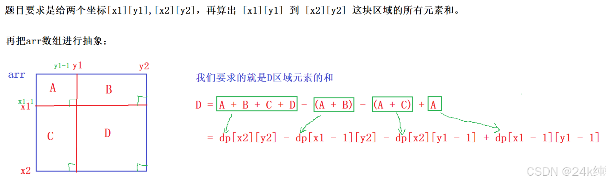

**前缀和算法**
- 前缀和算法一般应用于快速求出某个连续区间的和或者积。
- 四种题型：一维前缀和（模版）、二维前缀和（模版）、前缀和+哈希表、前后缀分解


**一维前缀和模版**

题目描述：给定一个长度为 n 的数组 a1,a2,a3,...an，接下来有 q 次查询，每次查询给出两个参数 l 和 r. 对于每次查询，给出 al 到 ar 的和

解法：
- 首先预处理一个前缀和数组，与原始数组相同大小，sum[i] 表示区间1~i区间所有元素的和。
- 递推公式 `sum[i] = sum[i-1]+arr[i]`
- 然后处理每次查询，区间和 `res = sum[r] = sum[l-1]`

```go
package main
import (
    "fmt"
)
func main() {
    // 处理输入
    var n int
    fmt.Scan(&n)
    arr := make([]int, n+1)
    for i:=1; i<=n; i++ {
        fmt.Scan(&arr[i])
    }
    // 预处理 sum
    psum := make([]int, n+1)
    s := 0
    for i:=1;i<=n; i++ {
        s += arr[i]
        psum[i] = s
    }
    // 执行查询
    var m, l, r int
    fmt.Scan(&m)
    for i:=1; i<=m; i++ {
        fmt.Scan(&l, &r)
        ans := psum[r] - psum[l-1]
        fmt.Println(ans)
    }
    return
}
```

**二维前缀和模板**

题目描述：给你一个 n 行 m 列的矩阵A, 下标从1开始。接下来有 q 次查询，每次输出 4 个参数 x1,y1,x2,y2。请输出以(x1,y1)为左上角，(x2,y2)为右下角的子矩阵的和

解法：
- 首先预处理一个前缀和数组，与原始数组相同大小。`sum[i][j]` 表示以`arr[1][1]`为左上角，以`arr[i][j]`为右下角的矩阵和。
- 递推公式 `sum[i][j] = sum[i-1][j] + sum[i][j-1] - sum[i-1][j-1] + arr[i][j]`
- 然后处理每次查询，区间和 `res = sum[x2][y2] - sum[x1-1][y2] - sum[x2][y1-1] + sum[x1-1][y1-1]`

递推公式图解




结果公式图解




```go
package main
import (
	"fmt"
)
func main() {
    // 处理输入
    var n,m,q int
    fmt.Scan(&n, &m, &q)
    matrix := make([][]int, n+1)
    psum := make([][]int, n+1)
    for i:=0; i<=n; i++ {
        matrix[i] = make([]int, m+1)
        psum[i] = make([]int, m+1)
        if i == 0 {
            continue
        }
        for j:=1; j<=m; j++ {
            fmt.Scan(&matrix[i][j])
        }
    }
    // 计算前缀和数组, 递推公式
    for i:=1; i<=n; i++ {
        for j:=1; j<=m; j++ {
            psum[i][j] = psum[i-1][j] + psum[i][j-1] - psum[i-1][j-1] + matrix[i][j]
        }
    }
    // 处理查询
    var x1,x2,y1,y2 int
    for i:=1; i<=q; i++ {
        fmt.Scan(&x1, &y1, &x2, &y2)
        ans := psum[x2][y2] - psum[x1-1][y2] - psum[x2][y1-1] + psum[x1-1][y1-1]
        fmt.Println(ans)
    }
}
```

**前缀和+哈希表**

题目描述：给定一个长度为 n 的数组，a1,a2,...,an 和一个整数 k, 请计算数组中连续区间和为 k 的子数组的个数

解法：
- 首先预处理一个前缀和数组，与原始数组 相同大小。sum[i] 表示区间1~i区间所有元素的和。（并加结果记录到哈希表中，记录每个和值出现的次数）
- 则区间[i,j]和为 sum[j]-sum[i-1], 则以 j 为右端点的满足条件的个数为满足 sum[j]-sum[i-1] = k 的 i 的个数。转化为满足 sum[i-1] = sum[j]-k 的 i 的个数
- 因此需要记录 sum[*] 到 哈希表中，并记录个数。遍历到元素 j 时，计算 sum[j]-k, 在哈希表中查找 sum[j]-k 了几次。其中 i 必须是下于 j 的，因此统计数量要与前缀求和一起进行

```go
package main
import (
	"fmt"
)
func main() {
    // 处理输入
    var n, k int
    fmt.Scan(&n, &k)
    arr := make([]int, n+1)
    for i:=1; i<=n; i++ {
        fmt.Scan(&arr[i])
    }
    // 计算前缀和，并写到 hashtable 中
    psum := make([]int, n+1)
    hashtable := map[int]int{}
    // 细节点, 表示空数组，处理sum-k==0时的特殊情况，此时单独自己一个元素组成一个连续序列
    hashtable[0]=1
    sum := 0
    ans := 0
    for i:=1; i<=n; i++ {
        // 计算结果,对于以 j 为右的连续序列[i,j]，对结果的贡献数 为 psum[j]-psum[i-1] = k 中 i 的个数
        // 转化为 psum[i-1] = psum[j]-k 中 i 的个数, 即 psum 中值为psum[j]-k的个数, 其中 i 是必须小于j的, 需要变计算前缀和，边计算结果
        sum += arr[i]
        psum[i] = sum
        if v, ok := hashtable[sum-k]; ok {
            ans += v
        }
        hashtable[sum]++
    }
    fmt.Println(ans)
}
```