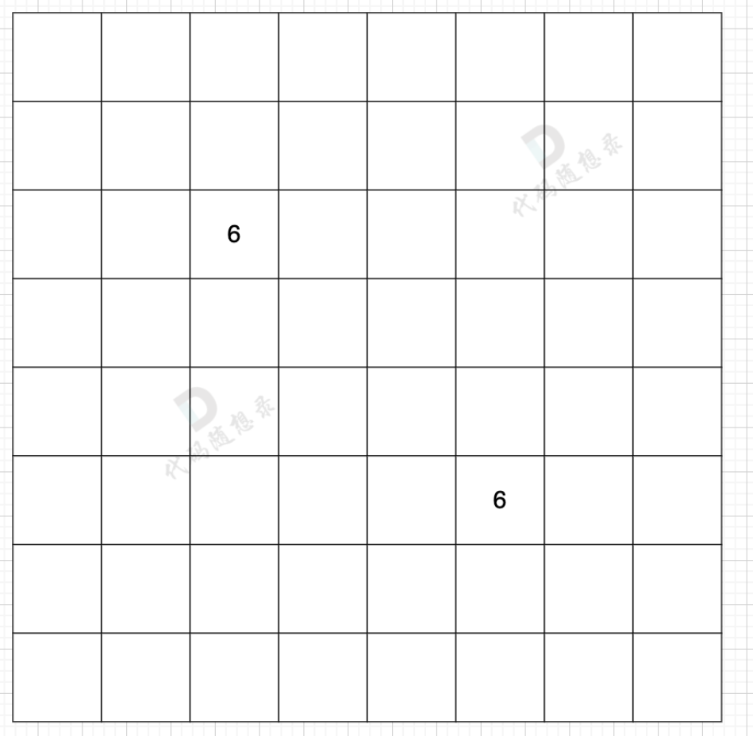
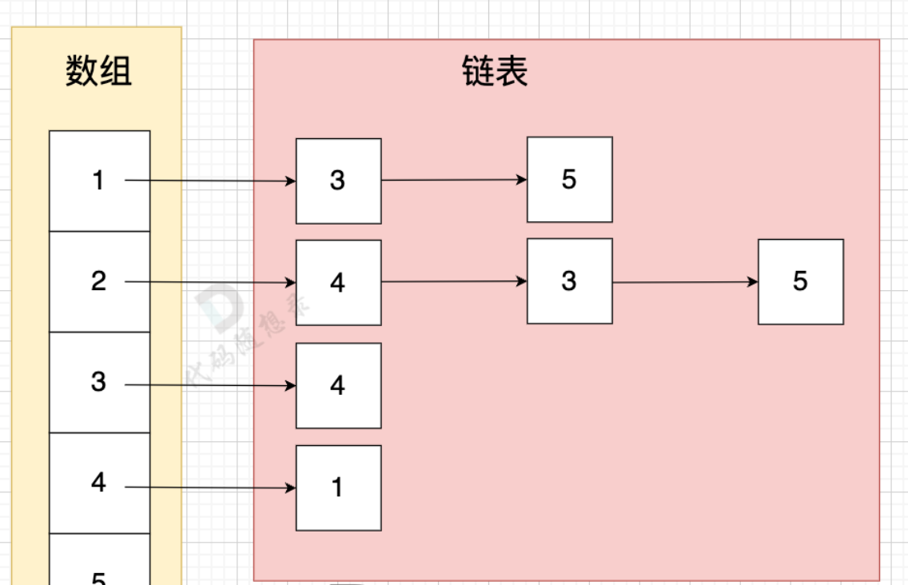
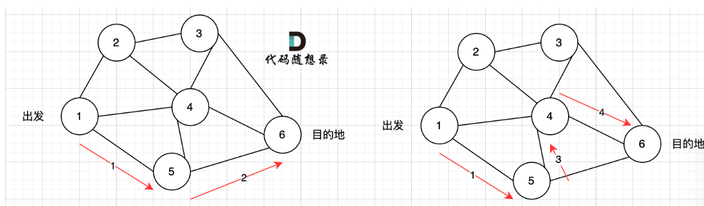

### 图论基础


图的分类：
- 有向图
- 无向图
- 加权有向图（边上有权值）
- 加权无向图（边上有权值）


度：
- 无向图：该节点连接的边数
- 有向图：分为出度和入度，出度是从该节点出发的边的个数，入度是指向该节点的边数

连通性：表示节点的连通情况
- 连通图：在无向图中，任何两个节点都是可以到达的，称之为连通图。
- 非连通图：在无向图中，如果有节点不能到达其他节点，则为非连通图
- 强连通图：在有向图中，任何两个节点是可以相互到达的，我们称之为强连通图
- 连通分量：在无向图中的极大连通子图称之为该图的一个连通分量。（包含所有的极大连通子图）
- 强连通分量：在有向图中极大强连通子图称之为该图的强连通分量。（包含所有的极大强连通子图）

图的存储方式：
- 邻接矩阵：使用二维数组来表示图结构。邻接矩阵是从节点的角度来表示图，有多少节点就申请多大的二维数组。可以存放0/1或者权值表示是否连通
  - 表达方式简单，易于理解
  - 检查任意两个顶点间是否存在边的操作非常快
  - 适合稠密图，在边数接近顶点数平方的图中，邻接矩阵是一种空间效率较高的表示方法。
  - 遇到稀疏图，会导致申请过大的二维数组造成空间浪费 且遍历 边 的时候需要遍历整个n * n矩阵，造成时间浪费
- 邻接表：使用 数组 + 链表的方式来表示。 邻接表是从边的数量来表示图，有多少边 才会申请对应大小的链表。数组存放所有的节点，边使用链表存放。
  - 对于稀疏图的存储，只需要存储边，空间利用率高
  - 遍历节点连接情况相对容易
  - 检查任意两个节点间是否存在边，效率相对低，需要 O(V)时间，V表示某节点连接其他节点的数量。
  - 

 
 


图的遍历：
- 深度优先遍历：DFS dfs是可一个方向去搜，不到黄河不回头，直到遇到绝境了，搜不下去了，再换方向（换方向的过程就涉及到了回溯）。
- 广度优先遍历：BFS bfs是先把本节点所连接的所有节点遍历一遍，走到下一个节点的时候，再把连接节点的所有节点遍历一遍，搜索方向更像是广度，四面八方的搜索过程。

DFS 的代码框架：递归+回溯
```
void dfs(参数) {
    if (终止条件) {
        存放结果;
        return;
    }
    for (选择：本节点所连接的其他节点) {
        处理节点;
        dfs(图，选择的节点); // 递归
        回溯，撤销处理结果
    }
}
```
1. 确认递归参数
通常我们递归的时候，我们递归搜索需要了解哪些参数，其实也可以在写递归函数的时候，发现需要什么参数，再去补充就可以。

一般情况，深搜需要 二维数组数组结构保存所有路径，需要一维数组保存单一路径，这种保存结果的数组，我们可以定义一个全局变量，避免让我们的函数参数过多。

```
vector<vector<int>> result; // 保存符合条件的所有路径
vector<int> path; // 起点到终点的路径
void dfs (图，目前搜索的节点)  
```

2. 确认终止条件
终止条件很重要，很多同学写dfs的时候，之所以容易死循环，栈溢出等等这些问题，都是因为终止条件没有想清楚
终止条件不仅是结束本层递归，同时也是我们收获结果的时候。

```
if (终止条件) {
    存放结果;
    return;
}
```

3. 处理目前搜索节点出发的路径
一般这里就是一个for循环的操作，去遍历 目前搜索节点 所能到的所有节点
   不少录友疑惑的地方，都是 dfs代码框架中for循环里分明已经处理节点了，那么 dfs函数下面 为什么还要撤销的呢。

```
for (选择：本节点所连接的其他节点) {
    处理节点;
    dfs(图，选择的节点); // 递归
    回溯，撤销处理结果
}
```

如图2所示， 路径2 已经走到了 目的地节点6，那么 路径2 是如何撤销，然后改为 路径3呢？ 其实这就是 回溯的过程，撤销路径2，走换下一个方向。

 

```
/*图的深度优先搜索遍历伪码*/
bool visited[MVNum];//标志访问数组，初值为false
void DFS(Graph G, int v)
{//从第v个顶点开始深度优先搜索遍历图G
	cout << v;visited[v] = true;//访问第一个顶点v ,访问标志符置为true
	for (w = FirstAdjVex(G,v);w >= 0;w = NextAdjVex(G, v, w))
	{
		if (!visited[w])
			DFS(G, w);//对v的没有被访问的顶点递归遍历
	}
}
//FirstAdjVex(G,v)表示v的第一个邻接点
//NextAdjVex(G, v, w)表示v相对于w的下一个邻接点
```


```
/*邻接矩阵的存储结构*/
typedef struct
{
	VerTexType vexs[MVNum];//顶点表
	ArcType arcs[MVNum][MVNum];//邻接矩阵
	int vexnum, arcnum;//当前图的顶点数和边数
}AMGraph;
/*邻接矩阵表示的图的DFS*/
void DFS_AM(AMGraph G, int v)
{//从第v个顶点依次遍历图G
	cout << v;//访问第v个顶点
	visited[v] = true;//访问标志符数组置为true
	for (w = 0;w <= G.vexnum;++w)//依次检查邻接矩阵v所在行
	{
		if ((G.arcs[v][w] != 0) && (!visited[w]))
			DFS_AM(G, w);//w是v的邻接点，如果w未被访问，则调用DFS_AM
	}
}
```

```
/*图的邻接表的存储定义*/
//弧的结点结构
#define MVNum 100	//最大的顶点数
typedef struct ArcNode
{
	int adjvex;	//该边所指的顶点的位置
	struct ArcNode* nextarc;	//指向下一条边的指针
	OtherInfo info;	//和边相关的信息
}ArcNode;
//顶点的结点结构
typedef struct VNode
{
	VertexType data;//顶点信息
	ArcNode* firstarc;//指向第一条依附该顶点的边
}VNode, AdjList[MVNum];//AdjList表示邻接表类型
//AdjList v相当于VNode v[MVNum]

//图的结构定义（邻接表）
typedef struct
{
	AdjList vertices;//vertices是vertex的复数
	int vexnum, arcnum;//图的当前顶点数和边数
}ALGraph;

/*采用邻接表表示图的DFS*/
void DFS_AL(ALGraph G, int v)
{//图G为邻接表类型，从第v个结点出发DFS图G
	cout << v;//访问第v个顶点
	visited[v] = true;//置访问标志符为true
	p = G.vertices[v].firstarc;//p指向v的边链表的第一个边结点
	while (p != NULL)//边结点非空
	{
		w = p->adjvex;//w是p的邻接点下标
		if (!visited[w])
			DFS_AL(G, w);//如果w未访问，则递归调用DFS_AL
		p = p->nextarc;//p指向下一个边结点
	}
}
```

```
/*非连通图G的深度优先搜索遍历*/
void DFSTraverse(Graph G)
{
	for (v = 0;v < G.vexnum;++v)
		visited[v] = false;//访问标志数组初始化
	for (v = 0;v < G.vexnum;++v)
		if (!visited[v])
			DFS(G, v);//对尚未访问的顶点调用DFS
}
```

广度优先搜索：使用辅助队列，和访问标记数组
```
int dir[4][2] = {0, 1, 1, 0, -1, 0, 0, -1}; // 表示四个方向
// grid 是地图，也就是一个二维数组
// visited标记访问过的节点，不要重复访问
// x,y 表示开始搜索节点的下标
void bfs(vector<vector<char>>& grid, vector<vector<bool>>& visited, int x, int y) {
    queue<pair<int, int>> que; // 定义队列
    que.push({x, y}); // 起始节点加入队列
    visited[x][y] = true; // 只要加入队列，立刻标记为访问过的节点
    while(!que.empty()) { // 开始遍历队列里的元素
        pair<int ,int> cur = que.front(); que.pop(); // 从队列取元素
        int curx = cur.first;
        int cury = cur.second; // 当前节点坐标
        for (int i = 0; i < 4; i++) { // 开始想当前节点的四个方向左右上下去遍历
            int nextx = curx + dir[i][0];
            int nexty = cury + dir[i][1]; // 获取周边四个方向的坐标
            if (nextx < 0 || nextx >= grid.size() || nexty < 0 || nexty >= grid[0].size()) continue;  // 坐标越界了，直接跳过
            if (!visited[nextx][nexty]) { // 如果节点没被访问过
                que.push({nextx, nexty});  // 队列添加该节点为下一轮要遍历的节点
                visited[nextx][nexty] = true; // 只要加入队列立刻标记，避免重复访问
            }
        }
    }
}
```


```
/*按广度优先非递归遍历连通图G*/
void BFS(Graph G, int v)
{
	cout << v;visited[v] = true;//访问第v个顶点
	InitQueue(Q);//辅助队列Q初始化，置空
	EnQueue(Q, v);//v进队
	while (!QueueEmpty(Q))//队列非空
	{
		DeQueue(Q, u);//队头元素出队并置为u
		for (w = FirstAdjVex(G, u);w>=0;w=NextAdjVex(G,u,w))
			if (!visited[w])//w为u的尚未访问的邻接顶点
			{
				cout << w;visited[w] = true;//置访问标志数组分量为true
				EnQueue(Q, w);//w进队
			}
	}
}
```